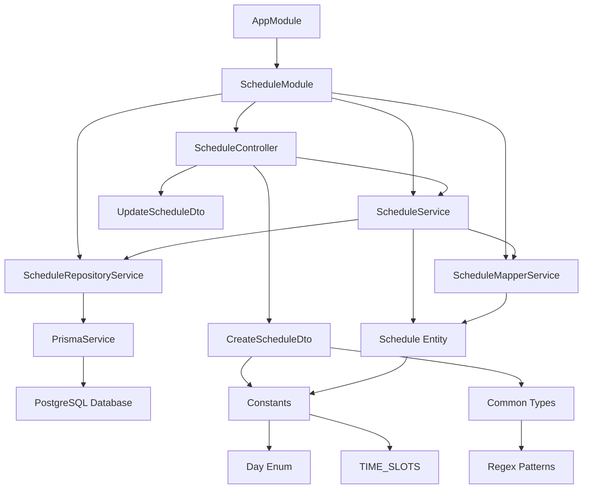

# System Patterns: Jose Backend

## Architecture

The application follows the NestJS modular architecture pattern, which emphasizes:

- Clear separation of concerns
- Modular design with feature-based modules
- Dependency injection for loose coupling
- Layer separation (controllers, services, entities, DTOs, constants)

## Key Technical Decisions

### Business Rules

- Schedule only available Monday through Saturday (no Sunday)
- Fixed time slots: 5:45-6:45pm, 6:45-7:45pm, and 7:45-8:45pm
- One hour duration for all classes
- Fixed set of valid time slots for consistency

### Database Schema

- PostgreSQL database hosted on Neon
- Using Prisma ORM for type-safe database operations
- The core model is the `Schedule` entity
- Time-based data stored as strings in "HH:MM" format for simplicity
- Normalized database structure with separate tables for teachers, rooms, subjects, and time slots

### API Design

- RESTful API endpoints following standard conventions
- Proper input validation using class-validator decorators
- Swagger documentation using NestJS Swagger integration
- Standard CRUD operations for schedule entries
- Special endpoints for filtering by day and finding current active class

### Validation

- Input validation using class-validator
- Data transformation using class-transformer
- Custom validators for time slots
- Enum-based validation for days of the week
- Shared regex patterns for common validations

### Exception Handling

- Using NestJS built-in exception filters
- Proper HTTP status codes for different error scenarios
- Custom error messages for better client understanding
- Logging with NestJS Logger service

## Design Patterns in Use

### Repository Pattern

- ScheduleRepositoryService abstracts database operations
- Handles all direct interactions with the Prisma client
- Focuses on data access concerns only
- Provides specialized methods for database operations
- Encapsulates database-specific logic and queries

### Mapper Pattern

- ScheduleMapperService handles entity transformation
- Maps between Prisma models and domain entities
- Contains utility methods for type conversions (e.g., Day enum mapping)
- Centralizes mapping logic to avoid duplication
- Provides consistent entity conversion throughout the application

### Service Layer Pattern

- ScheduleService implements business logic
- Uses repository for data access
- Uses mapper for entity transformations
- Focuses on orchestration and error handling
- Keeps business rules separate from data access and presentation

### Dependency Injection

- NestJS's built-in DI container for managing dependencies
- Services injected into controllers
- Repository and Mapper services injected into main service
- PrismaService injected into repository service

### DTO Pattern

- Separate DTOs for input validation and data transfer
- CreateScheduleDto for creating new entries with validation
- UpdateScheduleDto (extends PartialType of CreateScheduleDto) for updates

### Entity Pattern

- Schedule entity represents the domain model
- Contains business logic methods (getDuration, isInSession, etc.)
- Implements factory methods for data transformation

### Constants Pattern

- Enums and constant values extracted to dedicated files
- TIME_SLOTS constant defines available time slots
- Day enum defines available days of the week
- Shared regex patterns in common types directory

## Component Relationships

## File Organization

- `/src/modules/schedule/controllers`: Contains API controllers
- `/src/modules/schedule/services`: Contains business logic, repository, and mapper services
- `/src/modules/schedule/dto`: Contains data transfer objects for validation
- `/src/modules/schedule/entities`: Contains entity definitions
- `/src/modules/schedule/constants`: Contains enums and constant values
- `/src/common/services`: Contains shared services like PrismaService
- `/src/common/types`: Contains shared types and regex patterns
- `/prisma`: Contains database schema and migrations
